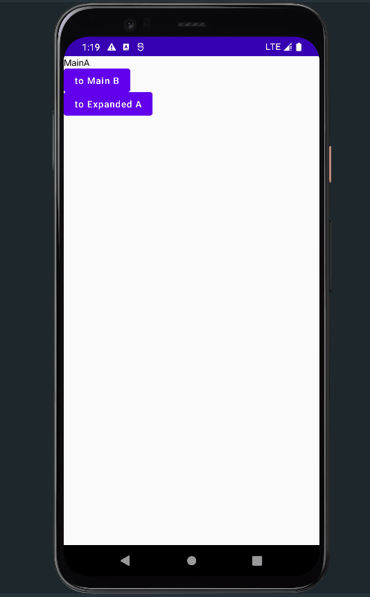
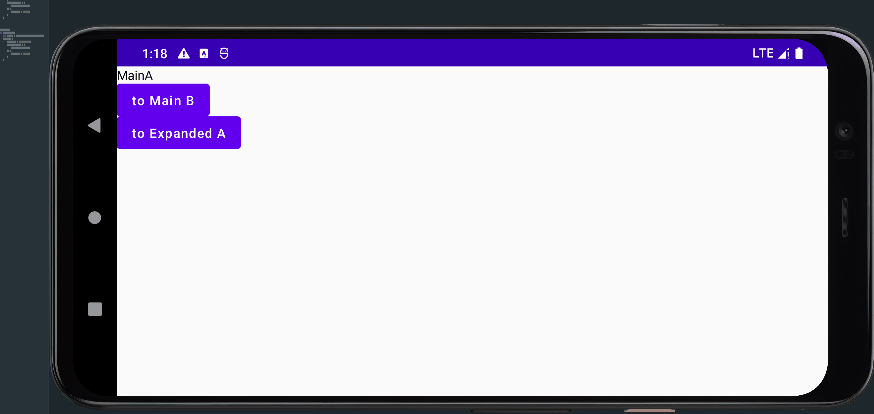

[](https://jitpack.io/#heyanLE/ExpandedStack)

一个 Compose 的一个支持平板双页面的回退栈管理组件 。

# 导入
```groovy
repositories {
    // Other
    maven {url 'https://jitpack.io'}
}
```

```groovy
implementation "com.github.heyanLE:ExpandedStack:1.3"
```

# 使用
```kotlin
// Activity
setContent {
    ExpandedStack(
        isHasExpanded = false // 是否开启扩展屏，这里需要自己根据屏幕宽度判断
    ) {
        // 最初的主页面的可组合函数
        MainA()
    }
}


@Composable
fun MainA(){
    // 获取 Entity 对象
    val entity = LocalPageStackEntity.current
    Column() {
        Text(text = "MainA")
        Button(onClick = {
            // 将 MainB push 进主屏幕栈
            entity.pushMain {
                MainB()
            }
        }) {
            Text(text = "to Main B")
        }
        Button(onClick = {
            // 将 ExpandedA push 进扩展屏栈
            entity.pushExpanded {
                ExpandedA()
            }
        }) {
            Text(text = "to Expanded A")
        }
    }

}
```

除此之外 `PageStackEntity` 还具有许多方法：
```kotlin

// push 进 当前所在屏幕栈
fun pushCurrent(content: @Composable ()->Unit){}

// push 进扩展屏栈
fun pushExpanded(content: @Composable ()->Unit){ }

// push 进 主屏幕栈
fun pushMain(content: @Composable () -> Unit){ }

// 按顺序推栈（推出最后入栈的屏幕，无论哪个栈）
fun popBack(){ }

// 当前栈出栈 （如果为主屏幕 第一个界面（最初的界面），则会无效）
fun popCurrent(){ }

// 主屏幕栈出栈
fun popMain(){ }

// 扩展屏栈出栈
fun popExpanded(){ }
```

# 未来展望
- 支持 Router
- 支持更多入栈模式，比如类似 SingleTop 等

# 效果：
单屏效果：


双屏效果：



